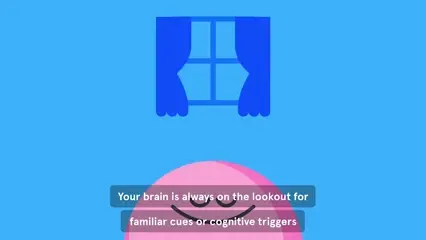
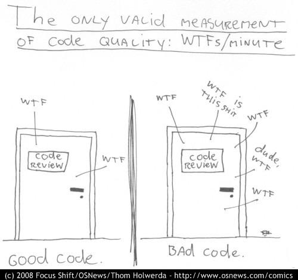
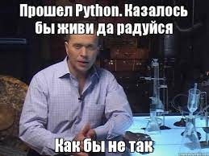
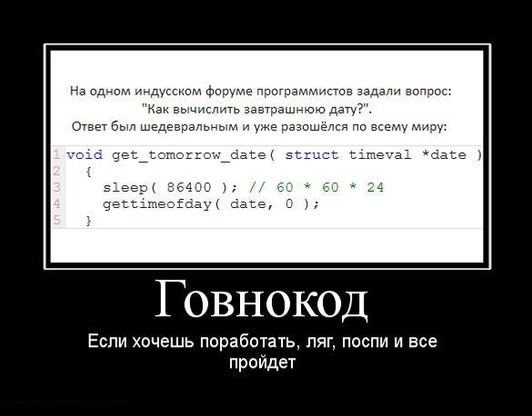

# Power of Vim on Windows

> Here will be diffrent files

## FocusMusic.webp

 

 
## gacchi.gif

 

 
## GoodCode.jpg

 

 
## MyCode.jpg

 

 
## PythonHappyLife.jpg

 

 
## Respect.gif

 

 
## ShitCode.jpg

 

 
## Waiting.jpg

 

 
